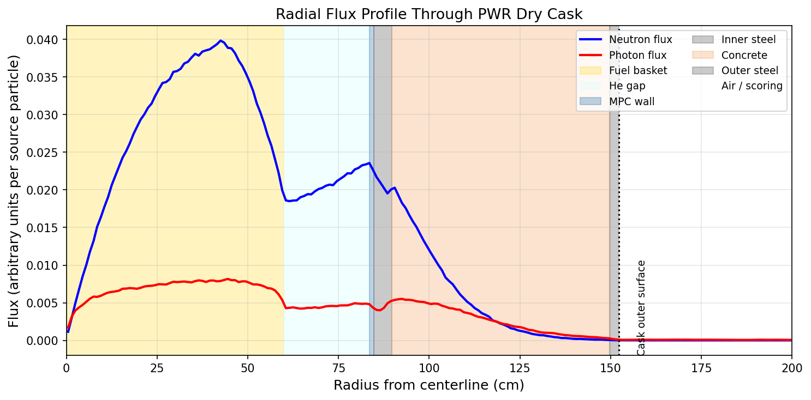
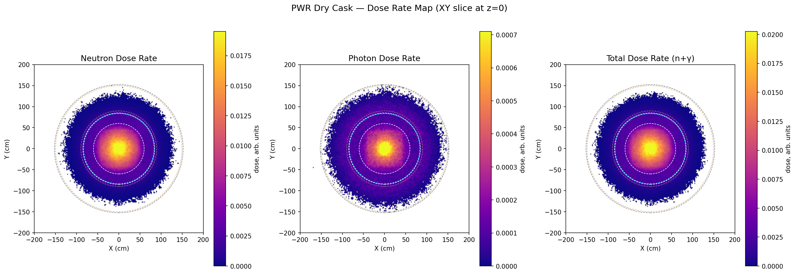

# PWR Dry Cask Storage — OpenMC Shielding Model

Monte Carlo shielding model of a generic PWR dry cask storage system built in OpenMC, loosely based on the Holtec HI-STORM 100 MPC. Models a 4x4 array of PWR fuel assemblies at explicit 17x17 pin-lattice resolution inside a stainless steel basket, helium-backfilled canister, and concrete/steel overpack.

## Geometry

Each of the 16 assembly slots contains a full 17x17 pin lattice with discrete fuel pellet, helium gap, Zircaloy-4 clad, and interstitial helium. This makes the model directly extensible to criticality analysis which is reserved for future work.

- **Fuel**: Spent UO₂ at ~45 GWd/tHM, 10-year cooling (NUREG/CR-6781)
- **Basket**: SS304, 4x4 assembly array within r=60 cm
- **Canister**: SS304 MPC wall, helium backfill
- **Overpack**: Carbon steel inner shell, 60 cm ordinary concrete, carbon steel outer shell

## Analysis

Fixed-source shielding calculation with coupled neutron/photon transport. Neutron source is a Watt fission spectrum (Cf-252 parameters, conservative for Cm-244 spontaneous fission). Photon source uses discrete gamma lines weighted by relative activity at 10-year cooling, dominated by Cs-137 at 662 keV.

Dose rates computed using ANSI/ANS-6.1.1 (neutron) and ICRP-116 (photon) flux-to-dose conversion factors.

## Results

## Requirements

- OpenMC ≥ 0.15
- ENDF/B-VIII.0 cross section library
- Python: numpy, matplotlib